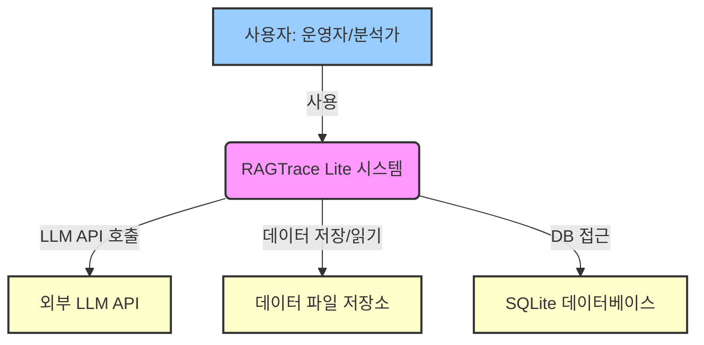
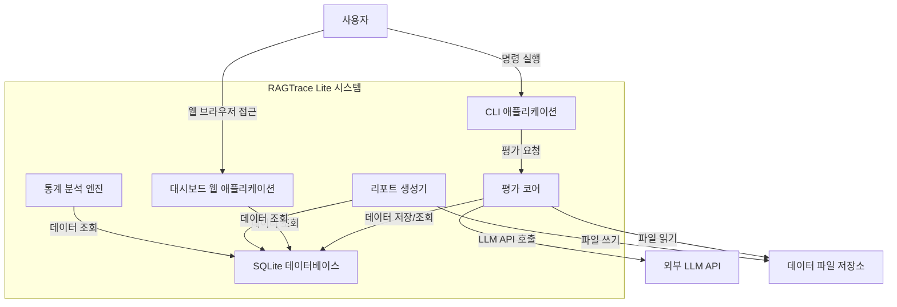
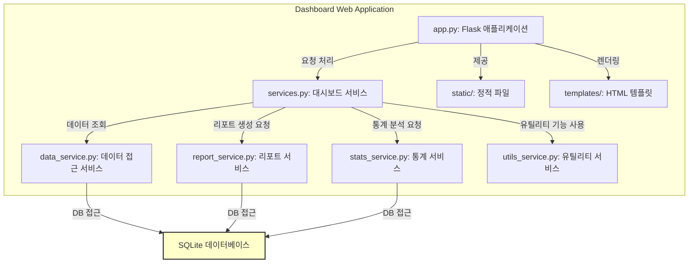

# RAGTrace Lite C4 아키텍처 뷰 (C4 Architecture Views)

이 문서는 RAGTrace Lite 프로젝트의 전체 아키텍처, 주요 구성 요소, 설계 원칙에 대해 상세히 설명합니다.

---

## 1. C4 모델이란?

Simon Brown이 제안한 아키텍처 문서화 표준으로, "Context → Containers → Components → Code" 4단계 뷰를 통해 상위 개념에서 구체 구현까지 점진적으로 줌인하는 방식입니다.

**핵심 철학:**
*   복잡한 시스템을 한 번에 설명하려 하지 않고 이해관계자 수준에 맞게 단계적으로 보여줍니다.
*   UML처럼 과도하게 상세하거나, 반대로 단순한 박스-라인 그림처럼 추상적이지 않은 중간 균형을 지향합니다.
*   각 뷰는 **"누가 보는가"와 "무엇을 알고 싶은가"**에 맞춰 설계됩니다.

---

## 2. 4가지 View 단계

### Level 1 — System Context Diagram

*   **목적**: 시스템이 무엇이며, 누가 사용하는지, 외부 시스템과 어떻게 연동되는지를 보여줍니다.
*   **포함 요소**: 시스템 자체(1개), 외부 액터(사람, 조직, 시스템), 외부 의존성(API, DB, 다른 시스템)
*   **질문에 답**: "이 시스템은 무엇을 하는가?", "누가 사용하고, 어떤 외부 시스템과 상호작용하는가?"

#### RAGTrace Lite System Context Diagram



**설명:**
RAGTrace Lite 시스템은 RAG(Retrieval-Augmented Generation) 시스템의 품질을 평가하고 추적하는 핵심 도구입니다.
*   **사용자 (운영자/분석가)**: RAGTrace Lite를 사용하여 평가를 실행하고, 결과를 분석하며, 대시보드를 통해 시각화된 보고서를 확인합니다.
*   **외부 LLM API**: 평가 과정에서 답변의 정확성, 충실도 등을 판단하기 위해 LLM(Large Language Model) API를 호출합니다. (예: Gemini, OpenAI, HCX 등)
*   **데이터 파일 저장소**: 평가에 사용될 입력 데이터(Excel, JSON)를 읽어오고, 생성된 보고서 등을 저장합니다.
*   **SQLite 데이터베이스**: 모든 평가 실행 기록, 메트릭 결과, 환경 변수 등을 로컬에 저장하는 데 사용됩니다.

---

### Level 2 — Container Diagram

*   **목적**: 시스템을 구성하는 최상위 실행 단위를 보여줍니다. Container는 물리적 컨테이너(Docker)와 관계없고, **"독립적으로 배포 가능한 실행 환경"**을 의미합니다.
*   **포함 요소**: UI/웹앱, API 서버, DB, 백그라운드 워커, 배치 잡, 외부 서비스 등
*   **질문에 답**: "시스템은 어떤 주요 실행 환경/서비스로 나눠져 있나?", "이 컨테이너들은 서로 어떻게 통신하나?"

#### RAGTrace Lite Container Diagram



**설명:**
RAGTrace Lite는 여러 독립적인 실행 단위(컨테이너)로 구성됩니다.
*   **CLI 애플리케이션**: 사용자가 터미널을 통해 평가를 시작하고 관리하는 주요 인터페이스입니다.
*   **대시보드 웹 애플리케이션**: 평가 결과를 시각화하고 관리하는 웹 기반 UI를 제공합니다.
*   **평가 코어 (Core Evaluator)**: 실제 RAG 평가 로직을 수행하는 핵심 엔진입니다. LLM API와 상호작용하며 평가 결과를 DB에 저장합니다.
*   **리포트 생성기 (Report Generator)**: DB에 저장된 평가 결과를 바탕으로 HTML, Markdown 등 다양한 형식의 보고서를 생성합니다.
*   **통계 분석 엔진 (Stats Engine)**: 평가 결과에 대한 고급 통계 분석(예: 시계열 분석, A/B 테스트)을 수행합니다.
*   **SQLite 데이터베이스 (DB)**: 모든 평가 데이터와 메타데이터를 저장하는 로컬 데이터베이스입니다.

---

### Level 3 — Component Diagram (Dashboard Web Application)

*   **목적**: 각 컨테이너 내부를 구성하는 **주요 구성 요소(모듈)**를 보여줍니다.
*   **포함 요소**: 주요 클래스, 모듈, 패키지, 라이브러리, 컨테이너 내부의 계층 구조(Controller, Service, Repository 등)
*   **질문에 답**: "이 컨테이너 안에서 주요 기능들은 어떻게 나눠져 있는가?", "각 구성 요소는 어떤 역할을 하고, 누구와 통신하는가?"

#### RAGTrace Lite Dashboard Web Application Component Diagram



**설명:**
대시보드 웹 애플리케이션은 Flask 프레임워크를 기반으로 하며, 다음과 같은 주요 구성 요소로 이루어져 있습니다.
*   **`app.py`**: Flask 애플리케이션의 메인 진입점입니다. URL 라우팅, 요청 처리, 템플릿 렌더링 등을 담당합니다.
*   **`services.py`**: 대시보드의 전반적인 비즈니스 로직을 처리하는 상위 서비스 계층입니다. 하위의 특정 서비스들을 조율합니다.
*   **`data_service.py`**: 데이터베이스로부터 데이터를 조회하고 가공하는 역할을 합니다.
*   **`report_service.py`**: 리포트 생성과 관련된 로직을 처리합니다.
*   **`stats_service.py`**: 통계 분석과 관련된 로직을 처리합니다.
*   **`utils_service.py`**: 대시보드 전반에 걸쳐 사용되는 유틸리티 함수들을 제공합니다.
*   **`static/`**: CSS, JavaScript, 이미지 등 웹 페이지에 필요한 정적 파일들을 포함합니다.
*   **`templates/`**: Jinja2 템플릿 엔진을 사용하는 HTML 파일들로, 동적으로 웹 페이지를 생성하는 데 사용됩니다.
모든 서비스 계층은 SQLite 데이터베이스와 상호작용하여 필요한 데이터를 가져옵니다.

---

### Level 4 — Code Diagram (LLM Adapter Pattern)

*   **목적**: 실제 구현 수준(클래스 다이어그램, 시퀀스 다이어그램 등)을 보여줍니다. 보통 문서화에서는 생략하거나, 중요한 알고리즘/클래스만 포함합니다.
*   **질문에 답**: "이 컴포넌트는 내부적으로 어떻게 구현되었는가?", "주요 메서드와 데이터 흐름은 무엇인가?"

#### RAGTrace Lite LLM Adapter Pattern Code Diagram

```mermaid
graph TD
    subgraph core/llm
        BaseAdapter[base_adapter.py: BaseLLMAdapter (추상 클래스)]
        AdapterFactory[adapter_factory.py: LLMAdapterFactory]
        GeminiProvider[providers/gemini_provider.py: GeminiProvider]
        HCXProvider[providers/hcx_provider.py: HCXProvider]
        OpenAIProvider[providers/openai_provider.py: OpenAIProvider]
        PromptEnhancer[prompt_enhancer.py: 프롬프트 최적화]
        ResponseProcessor[response_processor.py: 응답 처리]
    end

    AdapterFactory --> |생성| GeminiProvider
    AdapterFactory --> |생성| HCXProvider
    AdapterFactory --> |생성| OpenAIProvider

    GeminiProvider --|> BaseAdapter
    HCXProvider --|> BaseAdapter
    OpenAIProvider --|> BaseAdapter

    UserCode[사용자 코드 (예: evaluator.py)] --> |LLMAdapterFactory.get_adapter()| AdapterFactory
    AdapterFactory --> |반환| BaseAdapter
    UserCode --> |adapter.generate()| BaseAdapter
    BaseAdapter --> |호출| PromptEnhancer
    BaseAdapter --> |호출| ResponseProcessor
```

**설명:**
LLM Adapter 패턴은 RAGTrace Lite가 다양한 LLM(Large Language Model) 서비스와 유연하게 통합될 수 있도록 설계된 핵심 부분입니다.
*   **`BaseLLMAdapter` (추상 클래스)**: 모든 LLM 프로바이더가 구현해야 할 표준 인터페이스(예: `generate()` 메서드)를 정의합니다.
*   **`LLMAdapterFactory`**: 설정(예: `config.yaml`)에 따라 적절한 LLM 프로바이더(예: `GeminiProvider`, `HCXProvider`)의 인스턴스를 생성하여 반환합니다. 이를 통해 사용자 코드는 특정 LLM 구현에 종속되지 않고 `BaseLLMAdapter` 인터페이스만 알면 됩니다.
*   **`GeminiProvider`, `HCXProvider`, `OpenAIProvider`**: 각 특정 LLM 서비스의 API를 호출하고 응답을 처리하는 구체적인 구현체입니다. 모두 `BaseLLMAdapter`를 상속받아 표준화된 인터페이스를 제공합니다.
*   **`PromptEnhancer`**: LLM에 전달될 프롬프트를 최적화하거나 전처리하는 역할을 합니다.
*   **`ResponseProcessor`**: LLM으로부터 받은 원시 응답을 파싱하고, 필요한 형식으로 변환하며, 유효성을 검사하는 역할을 합니다.
이러한 구조를 통해 새로운 LLM 서비스가 추가되더라도 `BaseLLMAdapter`를 상속받는 새로운 프로바이더만 구현하면 되므로, 핵심 로직의 변경 없이 쉽게 확장할 수 있습니다.

---

## 3. C4 모델의 장점

1.  **가독성**: 각 단계별로 디테일을 적절히 조절하여 이해관계자별 맞춤 뷰를 제공합니다.
2.  **일관성**: 공통 포맷을 유지하여 문서를 읽는 사람이 쉽게 적응할 수 있습니다.
3.  **진화 용이성**: 특정 레벨만 수정해도 전체 구조를 유지할 수 있어 아키텍처 변경에 유연하게 대응합니다.
4.  **커뮤니케이션 효율**: 개발·운영·기획 등 다양한 팀이 동일한 그림을 기반으로 논의할 수 있어 의사소통 오류를 줄입니다.
