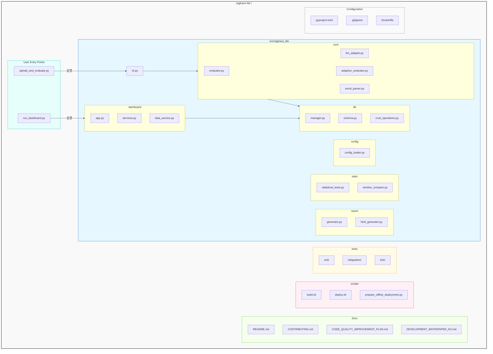

# RAGTrace Lite 프로젝트 아키텍처 가이드

이 문서는 RAGTrace Lite 프로젝트의 전체 아키텍처, 주요 구성 요소, 설계 원칙에 대해 상세히 설명합니다.

## 1. 설계 원칙과 철학 (Design Principles)

본 프로젝트는 다음과 같은 핵심 원칙을 바탕으로 설계되었습니다.

- **계층형 아키텍처 (Layered Architecture)**: 사용자 인터페이스(Presentation), 비즈니스 로직(Application), 핵심 도메인(Domain), 인프라(Infrastructure)의 4개 계층으로 역할을 분리하여 각 계층이 독립적으로 수정 및 확장될 수 있도록 합니다.
- **관심사 분리 (Separation of Concerns, SoC)**: 각 모듈은 하나의 명확한 책임만 갖습니다. 예를 들어, `db` 모듈은 데이터베이스 상호작용만 책임지며, `report` 모듈은 보고서 생성만 책임집니다. 이를 통해 코드의 복잡성을 낮추고 유지보수성을 극대화합니다.
- **모듈성 및 확장성 (Modularity and Extensibility)**: 새로운 LLM Provider, 평가 메트릭, 데이터 소스를 쉽게 추가할 수 있는 구조를 지향합니다. `core/providers`와 같은 플러그인 형태의 구조가 대표적입니다.
- **설정 기반 실행 (Configuration-driven)**: `pyproject.toml`과 `config.yaml` (미래) 등의 설정 파일을 통해 애플리케이션의 주요 동작과 의존성을 관리하여, 코드 변경 없이 유연하게 설정을 변경할 수 있습니다.

## 2. 아키텍처 다이어그램 (Mermaid)

## 3. 주요 구성 요소 상세 설명 (Component Breakdown)

### 3.1 사용자 진입점 (User Entry Points)
최상위 디렉토리에 위치하며, 사용자가 RAGTrace Lite의 주요 기능을 실행하는 시작점입니다.
- **`upload_and_evaluate.py`**: RAG 평가를 실행하는 주 CLI 스크립트입니다. 내부적으로 `src/ragtrace_lite/cli.py`를 호출하여 핵심 로직을 실행합니다.
- **`run_dashboard.py`**: 웹 대시보드를 실행하는 스크립트입니다. `src/ragtrace_lite/dashboard/app.py`를 호출하여 Flask 서버를 구동합니다.

### 3.2 핵심 애플리케이션 (`src/ragtrace_lite`)
프로젝트의 심장부로, 모든 비즈니스 로직이 여기에 위치합니다.
- **`cli.py`**: CLI 명령어 처리기입니다. `upload_and_evaluate.py` 같은 진입점 스크립트로부터 인자를 받아, `core` 모듈의 기능들을 순서대로 호출하고 조율하는 오케스트레이터 역할을 합니다.
- **`core/`**: 애플리케이션의 두뇌입니다.
    - `evaluator.py`: RAGAS 메트릭을 기반으로 실제 평가를 수행하는 핵심 엔진입니다.
    - `excel_parser.py`: 사용자가 제공한 Excel/JSON 파일을 읽고 파싱하여 평가에 사용할 수 있는 데이터 형태로 변환합니다.
    - `llm_adapter.py`: 다양한 LLM(Gemini, HCX 등)과의 상호작용을 표준화된 인터페이스로 추상화하는 어댑터 패턴을 구현합니다.
- **`db/`**: 데이터 영속성 계층입니다.
    - `schema.py`: SQLite 데이터베이스의 테이블 구조(스키마)를 정의합니다.
    - `manager.py`, `crud_operations.py`: 평가 결과, 실행 로그 등 모든 데이터를 DB에 저장하고 조회하는 로직을 담당합니다. 애플리케이션의 다른 부분은 이 모듈을 통해서만 DB에 접근해야 합니다(데이터 무결성 보장).
- **`dashboard/`**: 시각화를 위한 프레젠테이션 계층입니다.
    - `app.py`: Flask 애플리케이션의 본체로, 라우팅 및 서버 실행을 담당합니다.
    - `services.py`, `data_service.py`: `db` 모듈로부터 데이터를 조회하고, 웹 페이지에 맞게 가공하여 전달하는 역할을 합니다.
- **`report/` & `stats/`**: 분석 및 출력 계층입니다.
    - `report/`: 평가 결과를 HTML, Markdown 등 다양한 포맷의 보고서로 생성합니다.
    - `stats/`: 시계열 분석, 통계적 유의성 검증 등 고급 통계 기능을 제공합니다.

### 3.3 테스트 (`tests/`)
- **역할**: 코드의 품질을 보증하고, 새로운 변경으로 인한 기존 기능의 오작동(회귀)을 방지합니다.
- **정책**:
    - `unit/`: 함수나 클래스 등 가장 작은 단위의 기능을 독립적으로 테스트합니다.
    - `integration/`: 여러 모듈이 함께 동작할 때의 상호작용을 테스트합니다. (예: `core`와 `db`의 연동)
    - `e2e/`: 사용자 시나리오 전체(예: `upload_and_evaluate.py` 실행부터 보고서 생성까지)를 테스트합니다.

### 3.4 스크립트 (`scripts/`)
- **역할**: 빌드, 배포, 오프라인 패키지 생성 등 개발 및 운영에 필요한 자동화 작업을 담당합니다.
- **정책**: 핵심 애플리케이션 로직과 직접 관련 없는 일회성 또는 자동화 스크립트를 분리하여 `src` 디렉토리를 깨끗하게 유지합니다.

### 3.5 문서 (`docs/`)
- **역할**: 프로젝트의 공식적인 지식 베이스입니다. 아키텍처, 개발 가이드, 기여 방법 등 모든 비-코드 자산을 관리합니다.
- **정책**: `README.md`와 같은 최상위 문서를 제외한 모든 상세 문서는 `docs`에 위치시켜 루트 디렉토리의 가독성을 확보합니다.

### 3.6 설정 파일 (Root Configuration)
- **`pyproject.toml`**: Python 프로젝트의 표준 설정 파일. 프로젝트의 의존성, 메타데이터, 빌드 구성을 정의합니다.
- **`Dockerfile`**: Docker 컨테이너 환경을 정의하여, 어떤 환경에서든 동일하게 애플리케이션을 실행할 수 있도록 합니다.

## 4. 데이터 및 실행 흐름 (Data and Execution Flow)

### 시나리오 1: 평가 실행
1.  **사용자**: 터미널에서 `python upload_and_evaluate.py --file data.xlsx` 실행
2.  **`upload_and_evaluate.py`**: 입력을 받아 `cli.py`에 전달
3.  **`cli.py`**: `core/excel_parser.py`를 호출하여 `data.xlsx` 파싱
4.  **`core/evaluator.py`**: 파싱된 데이터를 받아 평가 실행. 이 과정에서 `core/llm_adapter.py`를 통해 LLM 호출
5.  **`db/manager.py`**: `evaluator.py`로부터 받은 최종 결과를 데이터베이스에 저장

### 시나리오 2: 대시보드 조회
1.  **사용자**: 터미널에서 `python run_dashboard.py` 실행
2.  **`run_dashboard.py`**: `dashboard/app.py`의 Flask 서버 시작
3.  **사용자**: 웹 브라우저에서 `http://localhost:8080` 접속
4.  **`dashboard/app.py`**: 요청을 받아 `dashboard/services.py` 호출
5.  **`dashboard/services.py`**: `db/manager.py`를 통해 DB에서 평가 목록 조회
6.  **`dashboard/app.py`**: 서비스로부터 받은 데이터를 HTML 템플릿에 렌더링하여 사용자에게 보여줌
